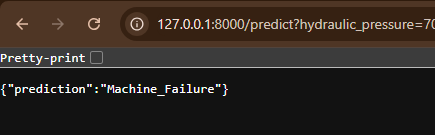
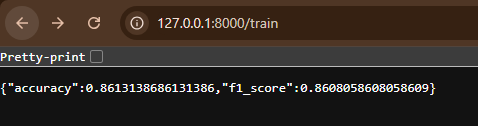

# Machine Downtime Prediction API

This project provides an API for predicting machine downtime based on various sensor parameters using a Logistic Regression model. The model is trained on a dataset of machine-related features, and predictions are made based on input values for these features.

## Project Structure

- `main.py`: Contains the FastAPI app, including endpoints for training the model and making predictions.
- `train.py`: Script to train the model (if you wish to run it separately).
- `data/`: Directory containing the dataset `machine_downtime.csv`
## Setup and Installation

### Prerequisites

1. Python 3.8 or later
2. Virtual environment

### Working

First, clone the repository and navigate to the project directory.
Run API using: uvicorn main:app --reload.
This will start the API on http://127.0.0.1:8000.

## Image Outputs:
1. Prediction
   

3. Training Accuracy and f1 score
   

